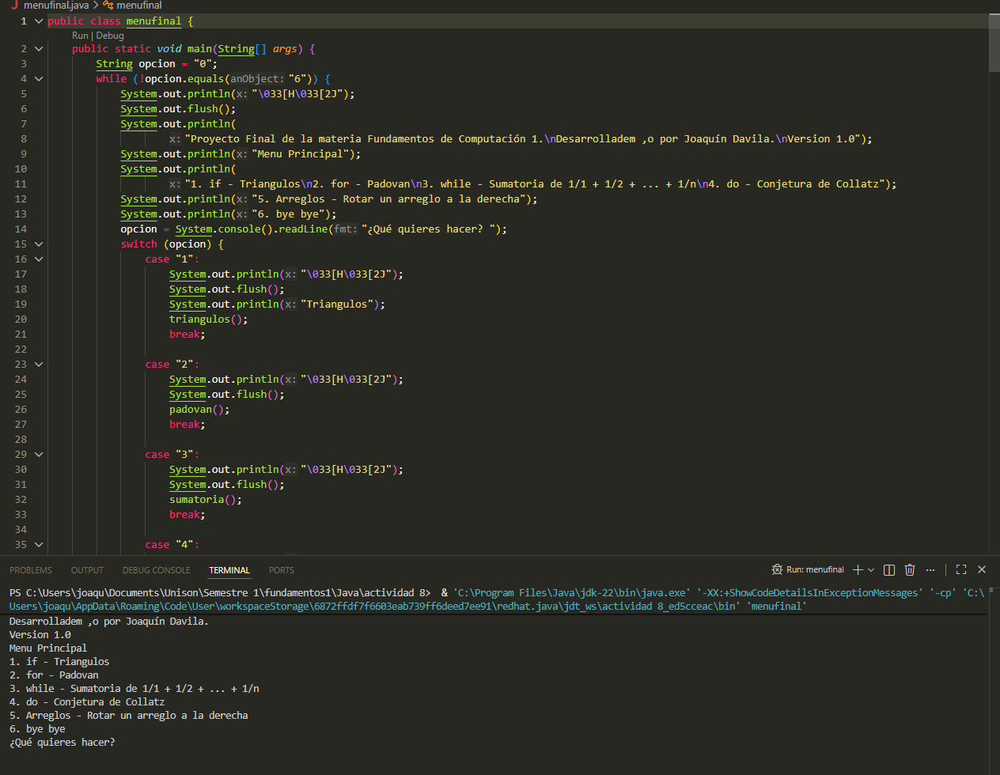

# Actividad 8 - Menú de Funciones iterativas en java

## Creador

**Joaquín Dávila**

## Descripción

Colección de programas en Java que se ejecutan por consola, desarrollados para la materia de Fundamentos de Computación 1 en la Universidad de Sonora (UNISON). Practican estructuras condicionales (`if`), ciclos (`for`, `while`, `do-while`) y arreglos. Además, el proyecto final, `menufinal`, reúne varios de estos ejercicios en un **menú principal** interactivo.

## Programas incluidos

### Menú principal (`menufinal.java`)

Muestra un menú que se repite hasta que se elige la opción 6:

| Opción | Tema | Qué hace |
|---|---|---|
| 1 | `if` – Triángulos | Recibe tres lados, indica si forman un triángulo y de qué tipo es (equilátero, isósceles o escaleno) |
| 2 | `for` – Padovan | Imprime la secuencia de Padovan hasta el límite indicado |
| 3 | `while` – Sumatoria | Calcula 1/1 + 1/2 + ... + 1/n y muestra el resultado con 2 decimales |
| 4 | `do-while` – Conjetura de Collatz | Muestra la secuencia de Collatz a partir de un número entero positivo |
| 5 | Arreglos – Rotar | Captura un arreglo de 10 enteros y un valor k, y lo rota k posiciones hacia la derecha |
| 6 | Salir | Termina el programa |

Las opciones validan la entrada: si el usuario escribe algo que no corresponde, el programa vuelve a pedir el dato. Después de cada ejercicio pregunta `Otra vez s/n?` para repetirlo o regresar al menú.

### Ejercicios individuales

| Archivo | Descripción |
|---|---|
| `triangulos_ej5.java` | Determina si tres longitudes forman un triángulo y su tipo |
| `for2.java` | Secuencia de Padovan hasta un límite |
| `for11.java` | Imprime las fracciones `i/j` en una tabla de n x n |
| `while2.java` | Secuencia de Fibonacci hasta un límite |
| `while3.java` | Sumatoria de 1 hasta n, mostrando la suma y su resultado |
| `while4.java` | Sumatoria 1/1 + 1/2 + ... + 1/n |
| `while5.java` | Imprime un triángulo de números (la fila i contiene el número i repetido i veces) |

## Requisitos

- Java JDK 15 o superior. El menú usa bloques de texto (`"""`), disponibles desde Java 15.
- Una **terminal real** (PowerShell, CMD, terminal de VS Code, etc.). Los programas leen la entrada con `System.console()`, que puede devolver `null` en algunas consolas integradas de IDEs.

## Cómo correrlo

1. Clona el repositorio:
```bash
   git clone https://github.com/Joaquin-Davila/<nombre-del-repositorio>.git
   cd <nombre-del-repositorio>
```
2. Compila el programa que quieras ejecutar. Para el menú principal:
```bash
   javac menufinal.java
```
3. Ejecútalo:
```bash
   java menufinal
```

Para correr un ejercicio individual, repite los pasos con su nombre, por ejemplo:

```bash
javac for2.java
java for2
```

## Imágenes

### Menú principal en ejecución


## Estructura del proyecto

```
<nombre-del-repositorio>/
├── menufinal.java
├── triangulos_ej5.java
├── for2.java
├── for11.java
├── while2.java
├── while3.java
├── while4.java
├── while5.java
├── imagenes/
│   └── menu-principal.png
└── README.md
```
